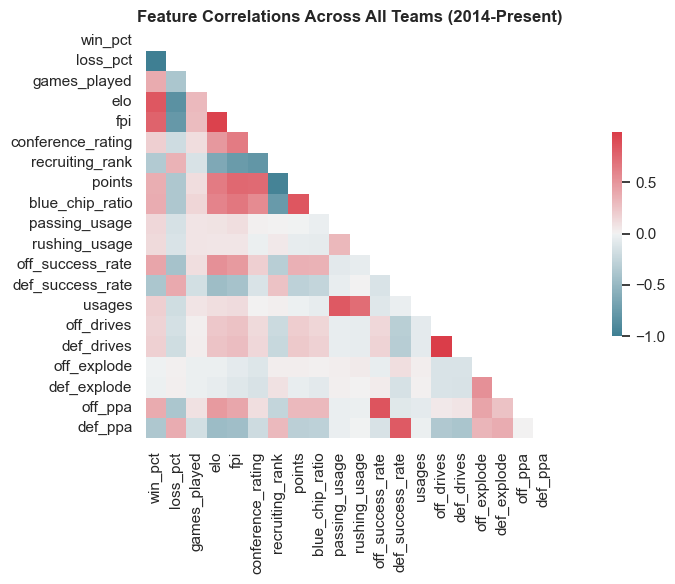
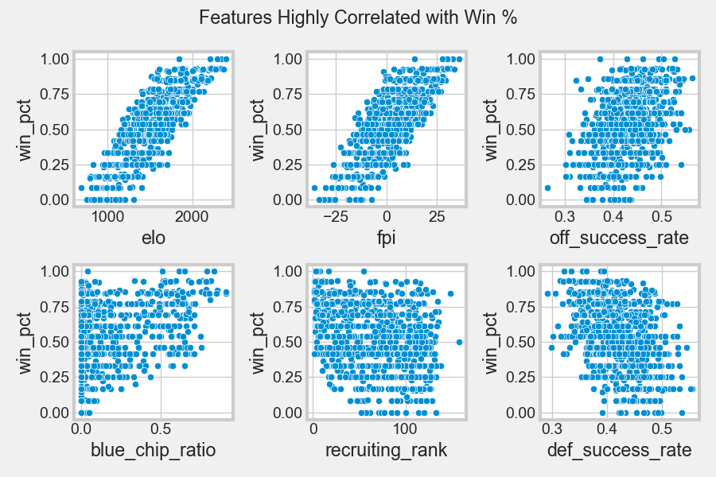
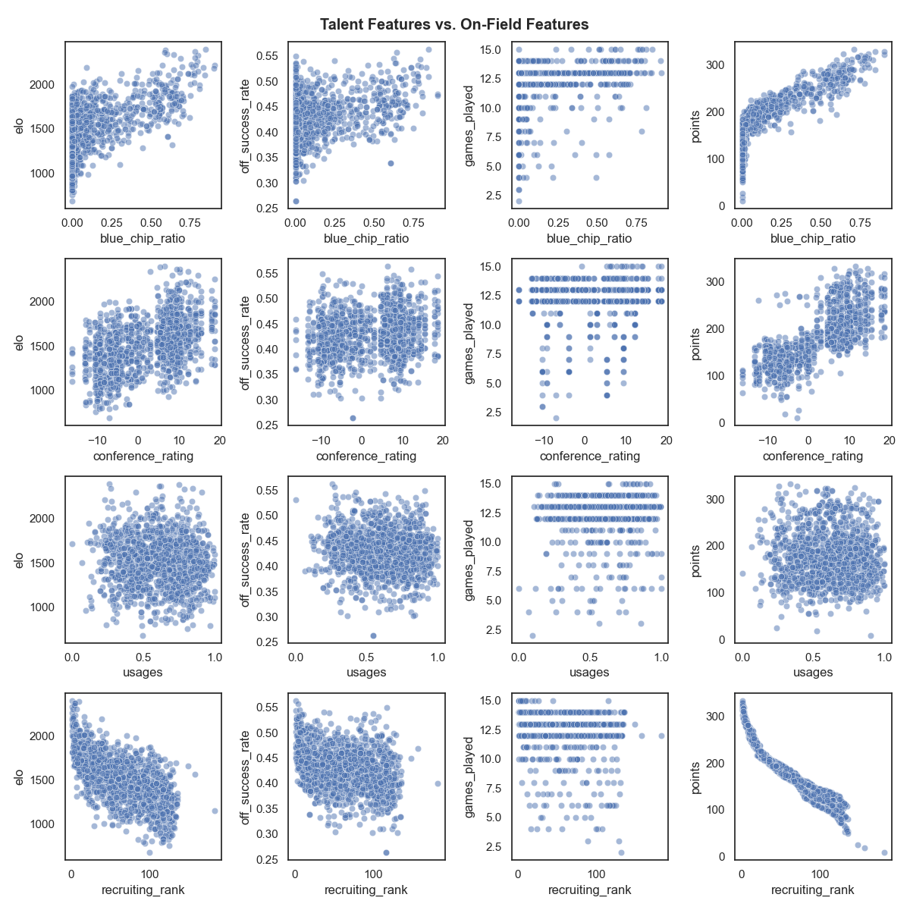
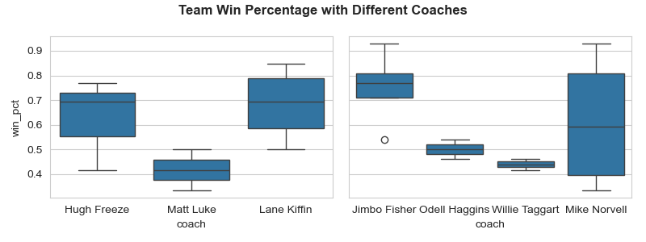
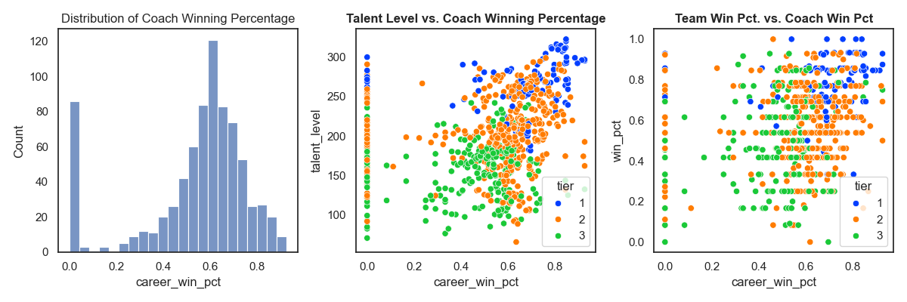
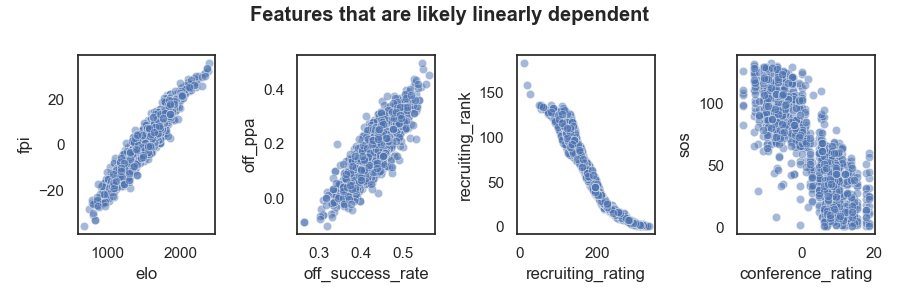
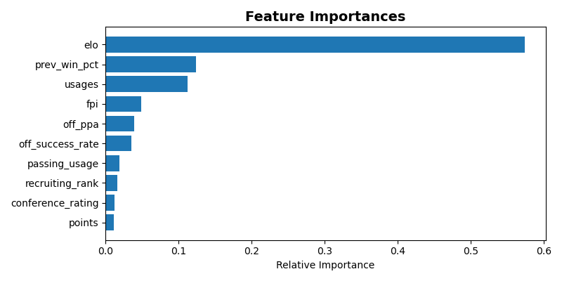
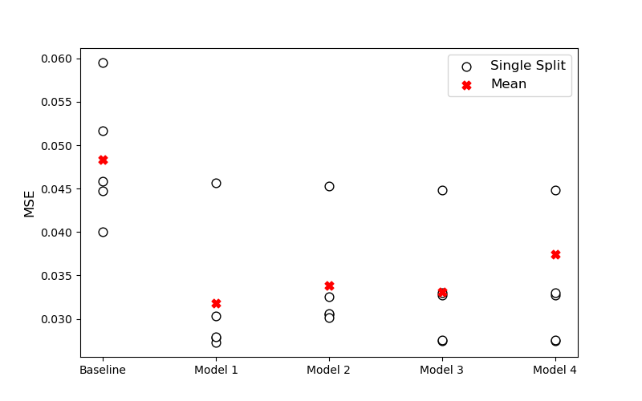
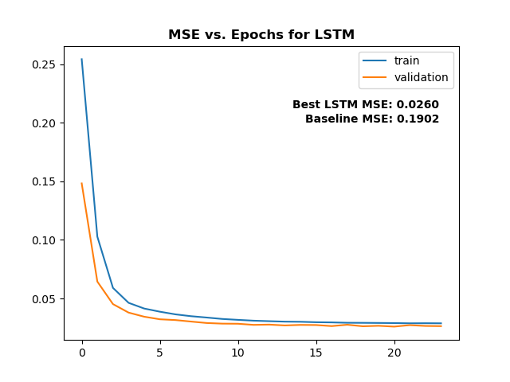
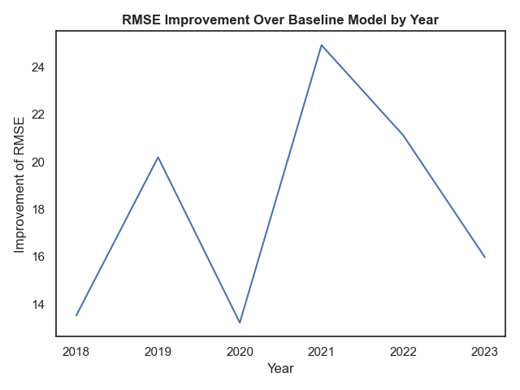

# Jimmys and Joes vs X’s and O’s
### *Predicting results in college sports analyzing talent accumulation and on-field success. A 2024 Erdös Institute Project.*
## Authors 
- Reggie Bain &nbsp; &nbsp; 
- Reid Harris &nbsp; &nbsp; 
- Tung Nguyen &nbsp; &nbsp;  
## Summary
We analyze college football data in an effort to build a model that can predict on-field success. By considering both talent accumulation and recent on-field results, our model aims to predict relevant results for sports betting/team construction. In this iteration of the project, **our target is the win percentage of teams in the regular season**.
## Background
Recent legislation has completely changed the landscape of college sports, a multi-billion dollar business with deep roots in American sports culture. With the recent legalization of sports betting in many states and the SCOTUS O’Bannon ruling [1-2] that allows athletes to be paid through so-called “Name-Image-Likeness (NIL)” deals [3], evaluating talent and projecting results in college sports, especially for the purpose of sports betting, is an increasingly interesting problem. We are interested in building a model to project on-field results in college football using a variety of features including an assessment of the talent level of teams as well as recent performance statistics. 
## Dataset(s)
Our dataset comes from a variety of sources including On3 [4], ESPN [5-6], 24/7 Sports [7], The College Football Database [8-9], and SportsReference [10]. We have used APIs and web scraping techniques to identify a wide array of college football features that aim to measure (1) on-field performance and (2) talent level including. These features include wins, conferences, team/player recruiting ratings, points/touchdowns scored, returning players, coaching win percentages, and a host of other more advanced features that we will describe below.   
As college football has grown exponentially in popularity since 2000 (with TV deals alone providing some universities with over $50 million dollars of annual revenue [11]) various sources have increased the amount of available data, especially concerning recruiting evaluation profiles of high-school athletes. Some data points, such as recruiting rankings and returning usage statistics, only had reliable data back to around 2010-2014. However, since rules and policies in college football have been changing so rapidly, we feel that **a 10 year window from 2014 to the present**, is adequate for making time-series predictions for the future. Additionally, **we considered only FBS teams** in our study, which are the top division teams in the NCAA.
## Stakeholders
- University athletic departments (for allocating NIL funds)
- College coaching staffs (for assembling rosters)
- Professional and amateur sports gamblers
## Key Performance Indicators (KPIs)
- Feature selection - identify key features that determine on-field outcomes
- Predict season win totals accurately - compare to baseline model naive forecast (same win % as previous year)
- Highly explainable model that allows for actionable insights
## EDA + Feature Engineering
### Advanced Metrics
- We considered a wide array of features that measured (1) previous on-field success and (2) talent level of each team in each year. These include some self-explanatory categories such as wins, losses, etc. But we also studied some more advanced analytics including those listed and defined in [9] below:
   1. **ELO Rating:** As defined in [12] and named for physicist Arpad Elo, "*the Elo rating system is a method for calculating the relative skill levels of players in zero-sum games such as chess*" Here defined for each team over time, ELO involves setting and iteratively updating expectation values of winning for each team using a formula of the form:
      - $E_A = \frac{1}{1 + 10^{(\frac{R_B - R_A}{400})}}$, expected rating for team A
      - $E_B = \frac{1}{1 + 10^{(\frac{R_B - R_A}{400})}}$, expected rating for team B
  2. **ESPN Football Power Index (FPI)**: Proprietary formula for predicting matchups between teams based on a wide array of factors. 
   3. **Offensive and Defensive Success Rate:** As defined by [9], a successful play is when the offense gains (opposite for defense)
      - $\geq$ 50% of yards to go gained on 1st down
      - $\geq$ 70% of yards to go gained on 2nd down
      - $\geq$ 100% of yards to go gained on 3rd or 4th down.
   4. **Usages:** The % of production (pass and run plays on offense and total snaps on defense) from the previous season that is returning for the current season.
### Feature Engineering   
 1. **Talent-Level:** A rolling average of the last 4 team recruiting ratings. Since players only have 4 years of eligiblility, we average over 4 years.
 2. **Blue-Chip Ratio:** We calculated **blue-chip ratios**, a popular metric invented by Bud Elliot that measures the % of current players on the roster that were "blue-chip" recruits. These are recruits that were rated 4/5 or 5/5 stars in the 247Sports Composite Rankings [13]. It has been shown to be predictive of the set of teams that can win the national championsip.
 3. **Coach Win Percentage:** For every coach, we found the career average winning percentage leading up to a given season.
 4. **Recent Team Win Percentage:** For each team, we calculated the average winning percentage over the last 4 years to gauge recent success. This likely has high correlation with ELO.
 5. **Turnover Margin:** The total number of turnovers (interceptions + fumbles) gained each season minus the total turnovers lost.
 ### Feature Correlations
 - Below, we show correlations between some of these features:

- Next, we investigated some of of the features that seemed to be correlated with target, team win percentage:

- We also studied the relationships between features, particularly those that had to do with on-field performance vs. those that had to deal with team talent level:

- In college sports, coaches have tended to make a rather large difference in the success of a program. See a few examples below in the last 10 years,:

- We also saw that coach career winning percentage (which will obviously have some linear dependence with team winning percentage) is definitely correlated with team talent level (i.e. better coaches get better players):

- In trying to select features, some of the advanced metrics and recruiting rating information provided redundant information. In some cases, features like FPI (which is proprietary) and ELO turned out to be closely related. Similarly, our talent_level metric was linearly dependent on blue chip ratio.

- Additionally, college sports has, historically, had several tiers of teams with a handful of teams seeing sustained success and many others having intermittent success. The features tend to have different relationships with the target depending on the tier of the team [14] 
## Modeling
### Approach 1: Regression over Season Level Features
- To predict winning percentage of each team, we used data from 2014-2023 with the features discussed above to perform regression focusing on 2014-2022 for training.
#### Feature Selection
- Using a random forest regressor, we measured the relative feature importance of our various features to see which ones reduced he impurity of the RF the most. ELO seemed to consistently dominate. *When predicting win percentage, this makes sense. If we were to use a different target such as points scored, other features would have higher relative importance.*

#### Models Used
- **Scaling:** We scaled the features to ensure that features like ELO that have extremely large values didn't arbitrarily dominate.
- **K-Fold Cross Validation:** We performed 5-fold cross validation for all of our models we describe below. We used **Mean Squared Error (MSE) as our loss metric** and took the average of the MSEs for each of our 5-folds. Our results are below:
- **Baseline Model:** Naive forecast. The baseline model was predicting next year will have the same win percentage as this year:
- **Classical ML Models:** We applied a variety of classical ML methods and found the following average MSE after cross validation:
  1. Linear Regression
  2. Random Forest Regressor
  3. XGBoost
- **Deep Learning - Long Short Term Memory (LSTM):** We implemented a basic LSTM using Tensorflow/Keras with one hidden LSTM layer and 1 Dense layer with one node.
#### Cross Validation Average Mean Squared Error

| model                   |   avg_mse |   avg_rmse |   pct_improve_mse |   pct_improve_rmse |
|:------------------------|----------:|-----------:|------------------:|-------------------:|
| Baseline Naive Forecast | 0.0484019 |   0.220004 |            0      |             0      |
| LinearRegression        | 0.0307367 |   0.175319 |           36.497  |            20.3112 |
| KNeighborsRegressor     | 0.0380674 |   0.195109 |           21.3515 |            11.316  |
| RandomForestRegressor   | 0.0329434 |   0.181503 |           31.9378 |            17.5002 |
| XGBRegressor            | 0.0382383 |   0.195546 |           20.9983 |            11.1171 |
| LSTM                    | 0.0337128 |   0.18361  |           30.3482 |            16.5424 |
### Approach 2: Game by Game Time Series Approach
## Results
#### Evaluating on the Test Set
- When evalauting our best model from cross-validation (Linear Regression) on the test set we got the results shown in the table below.

| model            |   test_mse |   test_rmse |   pct_improve_mse |   pct_improve_rmse |
|:-----------------|-----------:|------------:|------------------:|-------------------:|
| LinearRegression |  0.0252754 |    0.158982 |           35.5216 |            17.9031 |
| LSTM             |  0.0239591 |    0.154787 |           40.6756 |            20.5526 |

- Note: We also included the LSTM trained on all of the training data and tested on the test set as it out performed the other models. More details are given in the next section. Below, we have the training results from the LSTM.

#### COVID-19 and Cross Validation
- When performing cross validation for time series data, you have to take sucessive slices of the data and at some point you're predicting 2020, when the COVID-19 pandemic caused teams to play shortened seasons, have many players sit out at any given time, and many modified rules were in place.
- In the plot below you see that our model (as measured by how much better our RMSE is than the baseline) has its worst performance when trying to predict the covid season.
 
## Conclusions
#### EDA and Feature Selection
- We studied a wide array of features and found that ELO rating was the most important factor in modeling wins. It mattered more than any metrics related to talent or specific on-field statistics. 
- Although more study is needed, this suggests that sports betters should focus on recent results over perception of talent when making bets in the aggregate. They should still consider football specific matchup considerations.
- Additionally, metrics measuring talent level tended not to matter much, suggesting that teams should be wary of simply dumping more money into recruiting highly rated players and focus more on evaluating players as ratings may not predict performance well. 
- In fact, we discovered that recruiting rankings of players are actually dependent upon the schools that offered them, so a player would be given a higher rating because they had a scholarship offer from, say Alabama, which presents multicolinearity issues. These talent metrics are difficult to measure/define and not very predictive of wins.
- Coaching is important. The lifetime winning percentage of coaches was an important factor in the model. We showed that a given school can have very different winning % based on the coach even in a short time period.
#### Modeling Conclusions
- We created a model that outperfoms the naive forecast by nearly 36%. We found that, with cross validation Linear Regression worked best. When training on the entire training set, the LSTM worked best at roughly 40% above baseline.
- A better way to understand our results is in terms of numbers of games in a regular season. If we multiply our best model's RMSE by 12, we'll get an uncertainty in the number of wins in a season: 
$12 \times \text{RMSE}_{best} = \pm1.908 \,\, \text{games}$ 

## References
[1] https://www.americangaming.org/research/state-gaming-map/  
[2] https://cdn.ca9.uscourts.gov/datastore/opinions/2015/09/30/14-16601.pdf  
[3] https://www.ncaa.org/news/2021/6/30/ncaa-adopts-interim-name-image-and-likeness-policy.aspx  
[4] https://www.on3.com/nil/rankings/  
[5] https://www.espn.com/college-football/fpi  
[6] https://www.espn.com/blog/statsinfo/post/_/id/122612/an-inside-look-at-college-fpi  
[7] https://247sports.com/season/2024-football/compositeteamrankings/ 
[8] https://collegefootballdata.com/  
[9] https://collegefootballdata.com/glossary  
[10] https://www.sports-reference.com/  
[11] https://www.nytimes.com/athletic/5261402/2024/02/08/sec-payout-schools/  
[12] https://en.wikipedia.org/wiki/Elo_rating_system  
[13] https://247sports.com/article/blue-chip-ratio-2023-college-football-16-teams-who-can-actually-win-a-national-title-211217111/  
[14] https://www.cllct.com/sports-collectibles/memorabilia/how-much-did-your-school-get-to-appear-in-ea-college-football-25  
